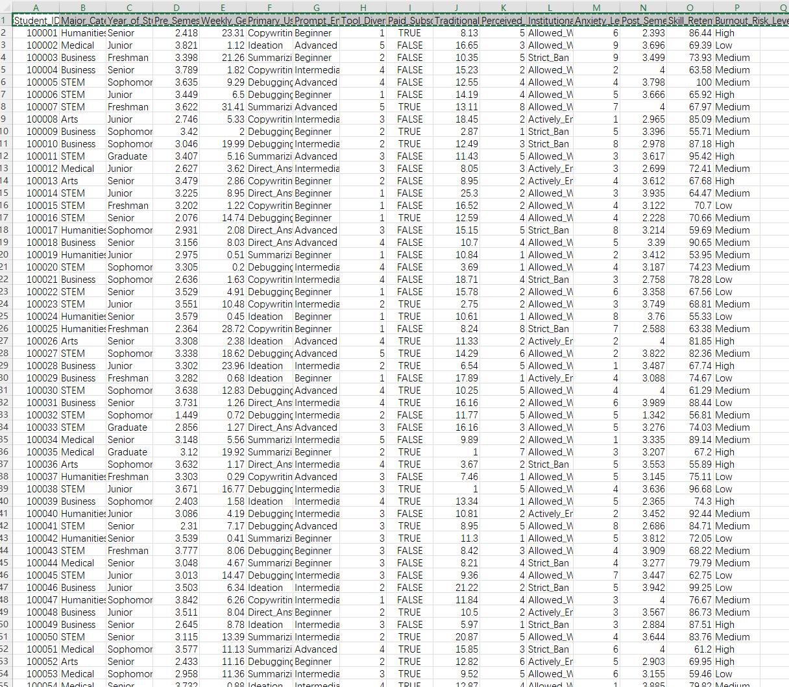
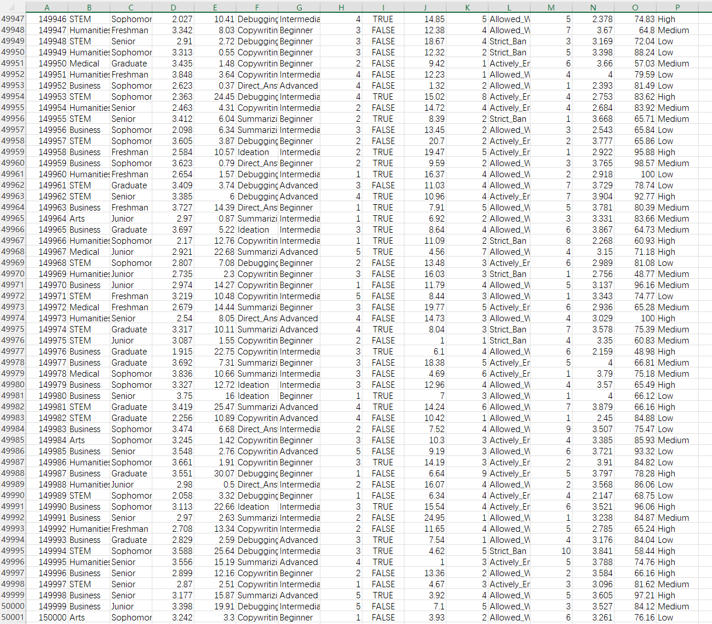
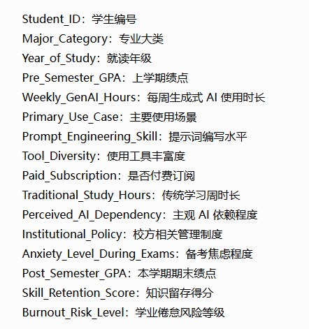

## Body

Artificial Intelligence Impact on Students

With the deep integration of generative AI tools into academic life, understanding their real impact on students is more critical than ever. This dataset provides rich and multi-dimensional snapshots of student interactions with AI—covering academic achievements, behavioral patterns, institutional backgrounds, and mental health.

Whether you are a researcher, educator, data scientist, or policymaker, this dataset offers fertile ground for exploring the pros and cons of AI in higher education.

Student_ID: Student ID
Major_Category: Major Category
Year_of_Study: Study Year
Pre_Semester_GPA: Pre-Semester GPA
Weekly_GenAI_Hours: Weekly Generative AI Hours
Primary_Use_Case: Main Use Case
Prompt_Engineering_Skill: Prompt Engineering Skill
Tool_Diversity: Tool Diversity
Paid_Subscription: Paid Subscription
Traditional_Study_Hours: Traditional Study Hours
Perceived_AI_Dependency: Perceived AI Dependency
Institutional_Policy: Institutional Policy
Anxiety_Level_During_Exams: Anxiety Level During Exams
Post_Semester_GPA: Post-Semester GPA
Skill_Retention_Score: Skill Retention Score
Burnout_Risk_Level: Burnout Risk Level

## Images

Here is a pay link on Stripe ( https://buy.stripe.com/3cs8yP7sY87d0vu9AB ). Please contact me lonlonago@foxmail.com after funding $89, and I will send you a complete data files , thank you!

